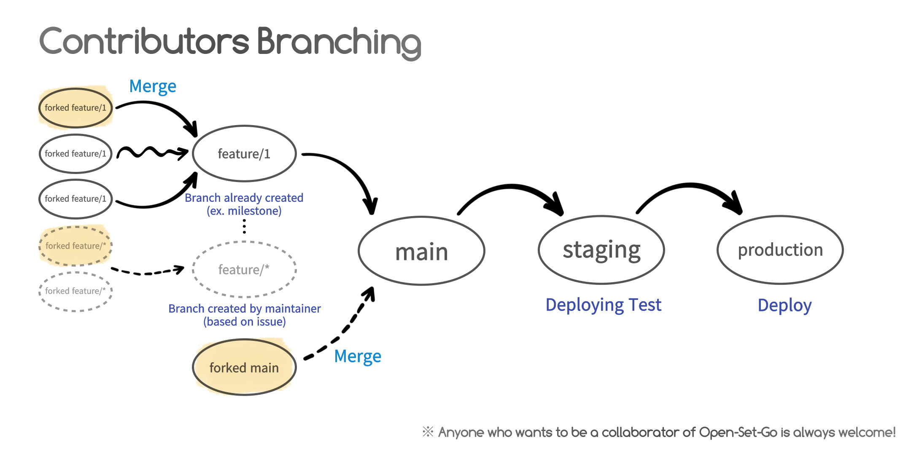
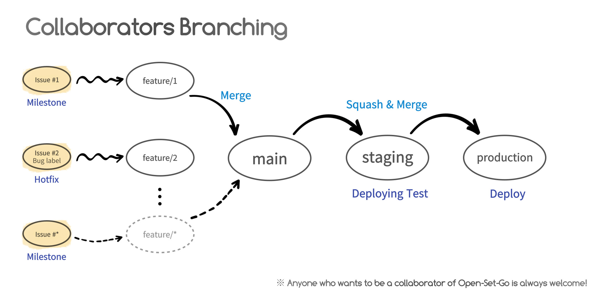

# Welcome to Open-Set-Go contributing guide

Thank you for investing your time in contributing to our project! Any contribution you make will be reflected on [Open-Set-Go.io](https://open-set-go.netlify.app/) & [README.md](https://github.com/AgainIoT/Open-Set-Go#contributors) ✨. 

We are committed to fostering a contribution-friendly environment that encourages contributions and aims to evolve into an open-source community. Please have a lot of conversations on [our Discussion](https://github.com/AgainIoT/Open-Set-Go/discussions)!

In this guide you will get an overview of the contribution workflow from opening an issue, creating a PR, reviewing, and merging the PR.

### Contributors

We want contributors to help us in the following areas.

- **Bugs**:  
    If you find any bugs, you can create [Issues](https://github.com/AgainIoT/Open-Set-Go/issues/new?assignees=&labels=bug&projects=&template=BugReport.yml&title=%F0%9F%90%9B+%5BBUG%5D+-+%3Ctitle%3E)</a>!

- **Security Problems**:  
    If you find security problems, please send them to [security mail](mailto:yunminwo1211@gmail.com) for big security issues and see [Security Policy](https://github.com/AgainIoT/Open-Set-Go/security/policy) for small ones!

- **Ideas**:  
    If you have any ideas for our project, please suggest it to the [Discussions](https://github.com/AgainIoT/Open-Set-Go/discussions/categories/ideas) or [Issues](https://github.com/AgainIoT/Open-Set-Go/issues/new?assignees=&labels=feature-request&projects=&template=FeatureRequest.yml&title=%F0%9F%9A%80+%5BREQUEST%5D+-+%3Ctitle%3E)!

- **Pull Requests**:  
    If you want to contribute to the project simply by code, please feel free to write a [Pull Requests](https://github.com/AgainIoT/Open-Set-Go/pulls) with an simple explanation.

- **Others**:  
    If there's anything you'd like to communicate about our project or open source, feel free to post it on [Discussions](https://github.com/AgainIoT/Open-Set-Go/discussions)! *"We hope that **Open-Set-Go Discussions** will become an active community."*

### Collaborators 

If you want to contribute directly to our project, be our collaborators at Open-Set-Go! Join the [Slack](https://join.slack.com/t/open-set-go/shared_invite/zt-21jwlzs9g-qrajfUblcCtmCqAy0Xxj8w) to become a collaborator!

- **Develop Main Features**:  
    Collaborator will develop the main features with maintainers based on milestone and issues.

- **Communication**:  
    Communicate with Open-Set-Go maintainers with [Slack](https://join.slack.com/t/open-set-go/shared_invite/zt-21jwlzs9g-qrajfUblcCtmCqAy0Xxj8w) to carry out the project.

### Code of Conduct
The maintainers who started the project are undergraduates of Kookmin University in South Korea. That's why we use English and Korean alternately. Of course, the project is based on English, but we welcome the contributions of both English and Korean.
~~_Don't be afraid We love English, too_~~

이 프로젝트를 시작한 maintainer들은 한국의 국민대학교 학부생들입니다. 그렇기 때문에 우리는 영어와 한국어를 같이 사용하고 있습니다. 물론, 프로젝트는 영어를 기반으로 하고 있지만, 영어와 한국어를 사용하는 기여를 모두 환영하고 있습니다. ~~_겁내지 말아요. 저희는 한국어를 사랑합니다._~~

_For more information, see [CODE_OF_CONDUCT.md](./CODE_OF_CONDUCT.md)._

### GitLab-flow
We are developing using GitLab-flow. See [GitLab-flow](https://about.gitlab.com/blog/2023/07/27/gitlab-flow-duo/) for more information.

#### For Contributors

#### For Collaborators

### Installation
If you want to install and test our project, please refer to [GitHub Wiki](https://github.com/AgainIoT/Open-Set-Go/wiki).

  

*
※ Anyone who wants to be a collaborator of Open-Set-Go is always welcome!
*
