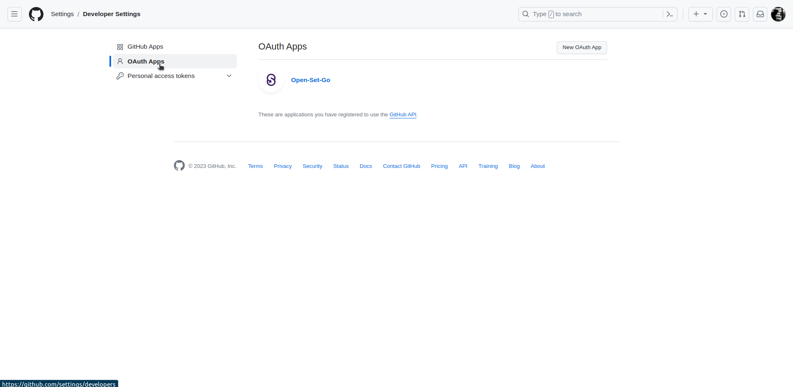
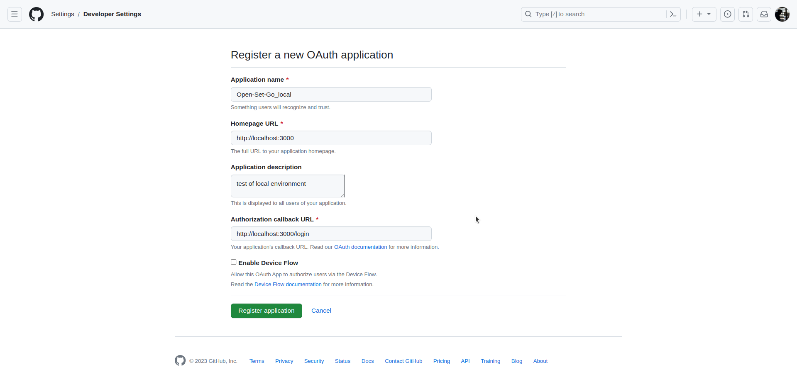
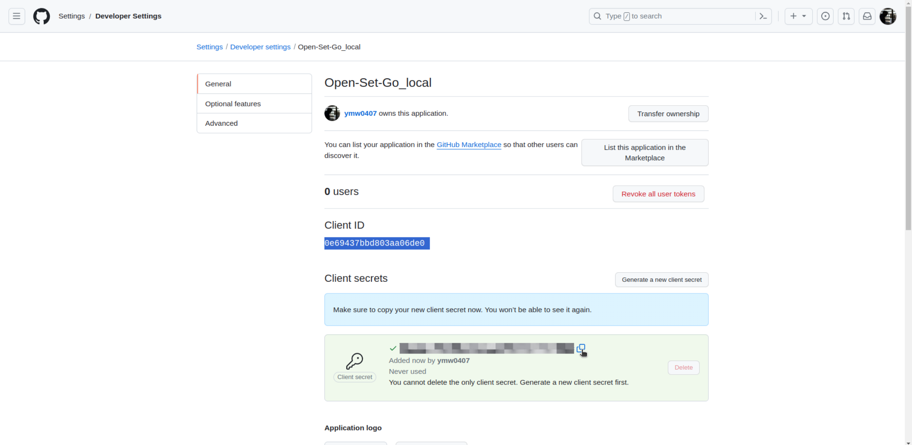

# Environment Variables

To run this project, you will need to add the following environment variables to your `.env` file

- [What's meaning of ...](#whats-meaning-of)
- [making with bash](#making-with-bash)
- [making with .env](#making-with-env)
  - [client](#client)
  - [server](#server)

<br>

## What's meaning of ...

```bash
$clientID
$clientSecret
$mongodbURI
$jwtToken
$jwtExpirationTime
$mailUser
$mailPass
```

### clientID & clientSecret

Client ID & Client Secret is generated by GitHub OAuth App!<br>
Follow each step to create your own GitHub Oauth App...

1. Login at [GitHub](https://github.com) & Access to [OAuth Apps](https://github.com/settings/developers)

   ```bash
    GitHub -> Settings -> Developer settings -> OAuth Apps
   ```

    

2. Click `New OAuth App` & insert your own data

   ```bash
    Application name: <any application name you want>
    Homepage URL: <any URL format you want>
    Authorization callback URL: http://localhost:3000/login
   ```

   > `Authorization callback URL`<br>
   > The Authorization callback URL is a redirect url that should be returned after you complete the OAuth login, with react server ip before and /login after.<br>
   > When you test with local environment, you should use `http://localhost:3000/login`

   

3. Get your OAuth App's Client ID & Client Secret<br>
   Click `Generate a new client secret` to get your own `ClientID` & `Client Secret`!

   

### mongodbURI

Build your own [MongoDB](https://www.mongodb.com/docs/manual/installation/) or Create cluster with [MongoDB Atlas](https://www.mongodb.com/ko-kr/cloud/atlas/lp/try4) & Get your [MongoDB's URI](https://www.mongodb.com/docs/v3.0/reference/connection-string/)

```bash
mongodb://[username:password@]host1[:port1][,host2[:port2],...[,hostN[:portN]]][/[database][?options]]
```

### jwtToken & jwtExpirationTime

`jwtToken` doesn't matter what word it is! However, please be careful not to space out! And `jwtExpirationTime` means the time the JWT token expires, and Open-Set-Go is using 18000 by default! (Units are `ms`!)

> [JWT(JSON Web Token)](https://jwt.io/introduction) <br>
> JWT is an open standard ([RFC 7519](https://datatracker.ietf.org/doc/html/rfc7519)) that defines a compact and self-contained way for securely transmitting information between parties as a JSON object. This information can be verified and trusted because it is digitally signed.

### mailUser & mailPass

Open-Set-Go sends you a mail when you first create a repository! Also, in order to send mail, you need the address of the mail and the app password to send!

> [Gmail App Password](https://support.google.com/mail/answer/185833?hl=en)<br>
> An app password is a 16-digit passcode that gives a less secure app or device permission to access your Google Account. App passwords can only be used with accounts that have 2-Step Verification turned on.<br>

<br>

## making with bash

Generate `.env` files(client & server) easily with env.sh

```bash
sudo bash env.sh
```

<br>

## making with .env

### client

```bash
REACT_APP_CLIENT_ID=$clientID
REACT_APP_REDIRECT_URL=http://localhost:3000/login # this must be same with your OAuth's redirect URL
REACT_APP_SERVER_URL=http://localhost:8080 # your server's URL
RECOIL_DUPLICATE_ATOM_KEY_CHECKING_ENABLED=false # env for recoil
```

> `REACT_APP_CLIENT_ID`<br>
> Details at [ClientID & ClientSecret](#clientid--clientsecret)

> `REACT_APP_REDIRECT_URL`<br>
> Details at [ClientID & ClientSecret](#clientid--clientsecret)

> `REACT_APP_SERVER_URL`<br>
> Use your server IP, default is `http://localhost:8080`!

> `RECOIL_DUPLICATE_ATOM_KEY_CHECKING_ENABLED`<br>
> Related to recoil!

### server

```bash
MONGODB_URI=$mongodbURI
CLIENT_ID=$clientID
CLIENT_SECRET=$clientSecret
JWT_SECRET=$jwtToken
JWT_EXPIRATION_TIME=$jwtExpirationTime
MAIL_USER=$mailUser
MAIL_PASS=$mailPass
ORIGIN=http://localhost:3000
```

> `MONGODB_URI`<br>
> Details at [MongodbURI](#mongodburi)

> `CLIENT_ID`<br>
> Details at [ClientID & ClientSecret](#clientid--clientsecret)

> `CLIENT_SECRET`<br>
> Details at [ClientID & ClientSecret](#clientid--clientsecret)

> `JWT_SECRET`<br>
> Details at [jwtSecret & jwtExpirationTime](#jwttoken--jwtexpirationtime)

> `JWT_EXPIRATION_TIME`<br>
> Details at [jwtSecret & jwtExpirationTime](#jwttoken--jwtexpirationtime)

> `MAIL_USER`<br>
> Details at [mailUser & mailPass](#mailuser--mailpass)

> `MAIL_PASS`<br>
> Details at [mailUser & mailPass](#mailuser--mailpass)

> `ORIGIN`<br>
> ORIGIN is an environmental variable to prevent CORS policy problems. You can create the IP of the client to use the server. Default is `http://localhost:3000`.
