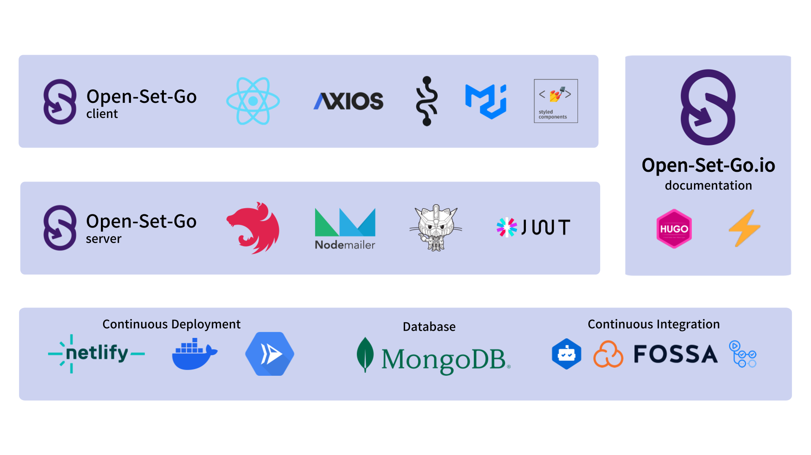
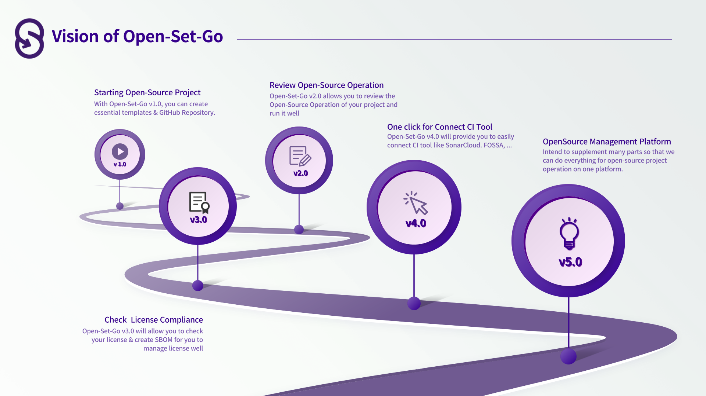
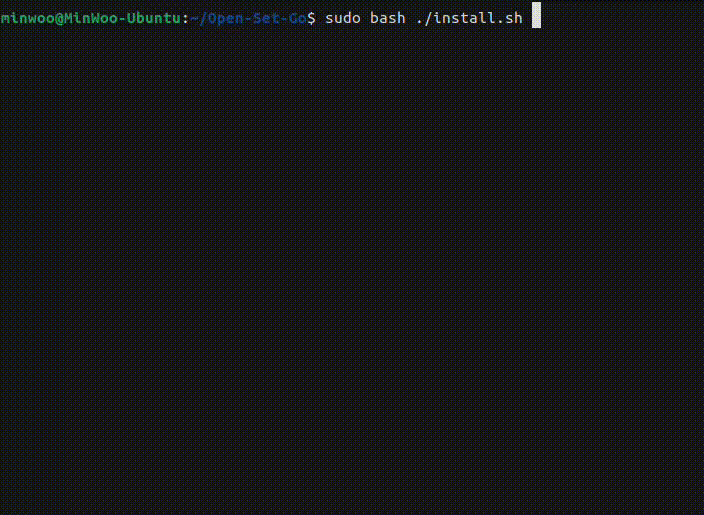

# Open-Set-Go

<p align="center">
<a href="https://www.open-set-go.com" target="blank"></a>
</p>

<p align="center">
  Manage Open-Source Projects from the beginning with 'Open-Source Management Platform', <a href="https://www.open-set-go.com" target="blank">Open-Set-Go</a>! 🚀
</p>

<p align="center">
  <a href="https://github/AgainIoT/Open-Set-Go"></a>
  <a href="https://sonarcloud.io/summary/new_code?id=AgainIoT_Open-Set-Go_server" target="_blank"></a>
  <a href="https://app.fossa.com/projects/git%2Bgithub.com%2FAgainIoT%2FOpen-Set-Go?ref=badge_shield" target="_blank"></a>
   <a href="https://www.open-set-go.com"></a>
  <a href="https://www.open-set-go.com"></a>
  <a href="https://join.slack.com/t/open-set-go/shared_invite/zt-21jwlzs9g-qrajfUblcCtmCqAy0Xxj8w" target="_blank"></a>
  <a href="https://github.com/AgainIoT/Open-Set-Go"></a>
  <a href="https://github.com/AgainIoT/Open-Set-Go"></a>
  <a href="/LICENSE"></a>
  <a href="https://github.com/AgainIoT/Open-Set-Go/graphs/contributors" target="_blank"></a>
  <a href="https://github.com/AgainIoT/Open-Set-Go"></a>
  <a href="https://github.com/AgainIoT/Open-Set-Go"></a>
</p>

<br>

## What is the **Open-Set-Go**?

**Open-Set-Go** is the `Open-Source Management Platform` for Open-Source Developers. Open-Set-Go provides the creation of new open-source projects and operational review for existing projects.

**Open-Set-Go** is dependent on **:octocat:GitHub**, and the GitHub OAuth 2.0 authorization process allows you analyze, create, and requests Pull-Request from your(or your organization's) GitHub repository.

- Create [Pull-Request Template](https://docs.github.com/en/pull-requests/collaborating-with-pull-requests/proposing-changes-to-your-work-with-pull-requests/creating-a-pull-request), [Issue Templates](https://docs.github.com/en/issues/tracking-your-work-with-issues/creating-an-issue), [README.md](https://docs.github.com/ko/repositories/managing-your-repositorys-settings-and-features/customizing-your-repository/about-readmes), [CONTRIBUTING.md](https://mozillascience.github.io/working-open-workshop/contributing/) with Open-Set-Go!

- Open-Set-Go provides documents from many well-known open-source projects and allows them to be modified with markdown editor!

- Create beautiful documents easily and simply using Open-Set-Go's personalized template!

<br>



## Why **Open-Set-Go**?

### For starting new Open-Source Project

It is not just to create a Source-Open Project, but to create a contribution-friendly environment and create an environment where communication between developers and contributors is smooth to create sustainable open source projects. <br>
In addition, **Open-Set-Go** makes it easy, fast, and simple to build a contribution-friendly environment at the start of an open-source project.

### For continuing the open-source project

It provides an open-source operation review feature for three areas for the open-source project in progress.

- Template: Ensure that there are templates required to sustain open source. Using the features of Open-Set-Go, additional templates can be created to make pull-request requests.

- Security: Check whether the features provided by GitHub for the security of open-source projects are activated.

- Community: Check the elements needed to build an open-source community.

## Vision of **Open-Set-Go**

Can see our vision for the foreseeable future at [our project's milestone](https://github.com/AgainIoT/Open-Set-Go/milestones) & [our wiki](https://github.com/AgainIoT/Open-Set-Go/wiki). <br>

Open-Set-Go is moving toward an Open-Source project management platform that can manage more parts. Join [Slack](https://join.slack.com/t/open-set-go/shared_invite/zt-21jwlzs9g-qrajfUblcCtmCqAy0Xxj8w) if you want to join us!

### Final Vision of Open-Set-Go

Open-Set-Go makes it easy, fast and simple to start an Open-Source project, while also sharing your own contribution environment and becoming a community driving the Open-Source trend. _Like GitHub._



## Installation & Development Environment

| Supported Environment | Version      | Description                                          |
| --------------------- | ------------ | ---------------------------------------------------- |
| Ubuntu OS             | Ubuntu 22.04 | Open-Set-Go_server was developed by Ubuntu OS        |
| Windows OS            | Windows 11   | Open-Set-Go_client was developed by Windows 11       |
| Node.js               | >= 18.x      | @ocotokit/rest & styled-reset require >= node v18.x  |
| yarn                  | 1.22.19      | Open-Set-Go server & client manage package with yarn |

1. Clone our repository!

   ```bash
   git clone --recursive https://github.com/AgainIoT/Open-Set-Go.git

   ######################################
   # Open-Set-Go Repository Dependencies
   #
   # Open-Set-Go
   #  ┣ Open-Set-Go.io
   #  ┣ Open-Set-Go_client
   #  ┗ Open-Set-Go_server
   #
   ######################################
   ```

2. Install with install.sh! (or check each other repository of [client](https://github.com/AgainIoT/Open-Set-Go_client#installation--development-environment) & [server](<(https://github.com/AgainIoT/Open-Set-Go_server#installation--development-environment)>)!)

   ```bash
   sudo bash ./install.sh
   ```

   

3. Add .env with env.sh! (more details at [EnvironmentVariable.md](./EnvironmentVariable.md))

   ```bash
   sudo bash ./env.sh
   ```

4. Excute each of client & server with `yarn start`!

   ```bash
   yarn start
   ```

## Documentation

We are conducting documentation at Open-Set-Go.io. Please refer to the following. _You can see our technical blog & showcase & documentation on Open-Set-Go.io_

- <a href="https://docs.open-set-go.com">Open-Set-Go.io</a>

## Contributing

We always welcome your contributions. Please see the <a href="./CONTRIBUTING.md">CONTRIBUTING.md</a> for how to contribute. <br>
Also, we are recruiting collaborators, so if you are interested, please join our [Slack](https://join.slack.com/t/open-set-go/shared_invite/zt-21jwlzs9g-qrajfUblcCtmCqAy0Xxj8w)!

## Contributors

Thank you to everyone who contributed to our project. Any contribution you make will be reflected on [RELEASE.md](./RELEASE.md)

### Open-Set-Go

<a href="https://github.com/AgainIoT/Open-Set-Go/graphs/contributors">
  
</a>

### Open-Set-Go_client

<a href="https://github.com/AgainIoT/Open-Set-Go_client/graphs/contributors">
  
</a>

### Open-Set-Go_server

<a href="https://github.com/AgainIoT/Open-Set-Go_server/graphs/contributors">
  
</a>

_<div align=right>Made with <a href="https://contrib.rocks">contrib.rocks</a></div>_

## License

**Open-Set-Go** is released under <a href="https://www.apache.org/licenses/LICENSE-2.0">Apache-2.0 License</a>.<br>
See the <a href="./LICENSE">LICENSE file</a> for details. <br>

<a href="https://app.fossa.com/projects/git%2Bgithub.com%2FAgainIoT%2FOpen-Set-Go?utm_source=share_link"></a>
<a href="https://app.fossa.com/projects/git%2Bgithub.com%2FAgainIoT%2FOpen-Set-Go_server?utm_source=share_link"></a>
<a href="https://app.fossa.com/projects/git%2Bgithub.com%2FAgainIoT%2FOpen-Set-Go_client?utm_source=share_link"></a>
<a href="https://app.fossa.com/projects/git%2Bgithub.com%2FAgainIoT%2FOpen-Set-Go.io?utm_source=share_link"></a>
