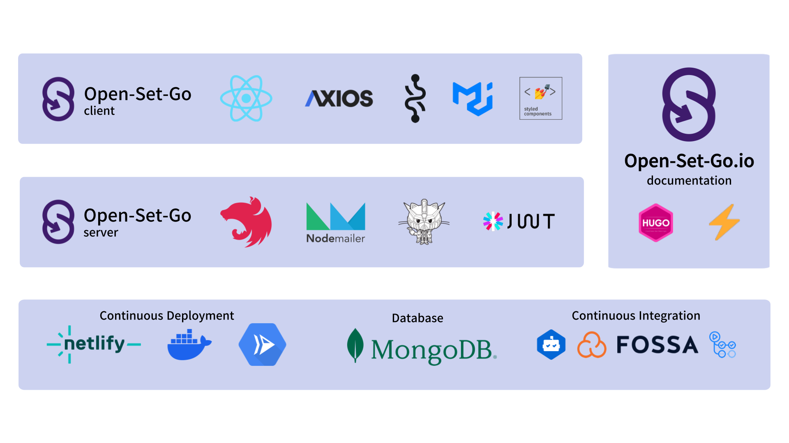
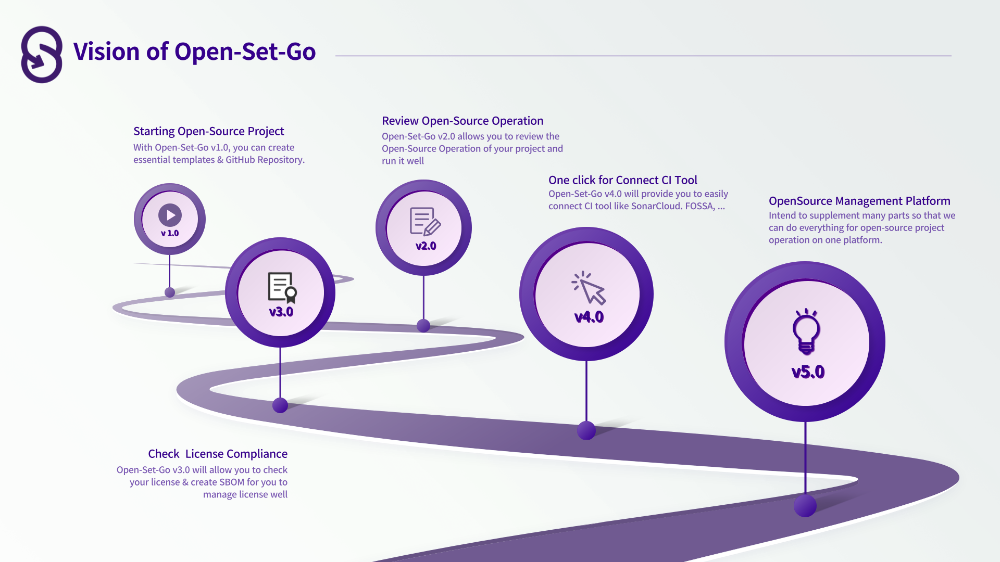

# Open-Set-Go

<p align="center">
<a href="https://www.open-set-go.com" target="blank"></a>
</p>

<p align="center">
  오픈소스 프로젝트를 시작부터 '오픈소스 관리 플랫폼'인 <a href="https://www.open-set-go.com" target="blank">Open-Set-Go</a>를 통하여 관리해보세요! 🚀
</p>

<p align="center">
  <a href="https://github/AgainIoT/Open-Set-Go"></a>
  <a href="https://sonarcloud.io/summary/new_code?id=AgainIoT_Open-Set-Go_server" target="_blank"></a>
  <a href="https://app.fossa.com/projects/git%2Bgithub.com%2FAgainIoT%2FOpen-Set-Go?ref=badge_shield" target="_blank"></a>
   <a href="https://www.open-set-go.com"></a>
  <a href="https://www.open-set-go.com"></a>
  <a href="https://join.slack.com/t/open-set-go/shared_invite/zt-21jwlzs9g-qrajfUblcCtmCqAy0Xxj8w" target="_blank"></a>
  <a href="https://github.com/AgainIoT/Open-Set-Go"></a>
  <a href="https://github.com/AgainIoT/Open-Set-Go"></a>
  <a href="/LICENSE"></a>
  <a href="https://github.com/AgainIoT/Open-Set-Go/graphs/contributors" target="_blank"></a>
  <a href="https://github.com/AgainIoT/Open-Set-Go"></a>
  <a href="https://github.com/AgainIoT/Open-Set-Go"></a>
</p>

<h4 align="center">
    <p>
        <b>English</b> |
        <a href="https://github.com/AgainIoT/Open-Set-Go/">한국어</a>
    </p>
</h4>

_<div align=center>보다 많은 사람들이 활용할 수 있도록 번역에 기여해시면 감사하겠습니다!</div>_

<br>

## **Open-Set-Go**란?

**Open-Set-Go**는 공개SW 개발자들을 위한 `오픈소스 관리 플랫폼`입니다. Open-Set-Go는 새로운 오픈소스 프로젝트를 시작 및 설정을 지원하며, 진행중인 오픈소스 프로젝트에 대해서 오픈소스 운영 검증을 지원합니다.

**Open-Set-Go**는 **:octocat:GitHub**에 종속되어있으며, GitHub OAuth 2.0 인가 과정을 통해서 사용자(혹은 사용자의 조직)의 GitHub Repository를 분석하고, 생성하고, Pull-Request를 요청합니다.

- [Pull-Request Template](https://docs.github.com/en/pull-requests/collaborating-with-pull-requests/proposing-changes-to-your-work-with-pull-requests/creating-a-pull-request), [Issue Templates](https://docs.github.com/en/issues/tracking-your-work-with-issues/creating-an-issue), [README.md](https://docs.github.com/ko/repositories/managing-your-repositorys-settings-and-features/customizing-your-repository/about-readmes), [CONTRIBUTING.md](https://mozillascience.github.io/working-open-workshop/contributing/)를 Open-Set-Go를 통해 생성하세요!

- Open-Set-Go는 많은 유명한 오픈소스 프로젝트들의 문서들을 제공하고, markdown editor를 통하여 수정할 수 있도록 해줍니다!

- Open-Set-Go만의 개인화된 template을 활용하여 쉽고 간편하게 예쁜 문서들을 제작하세요!

<br>



## 왜 **Open-Set-Go**를 사용해야 하나요?

### 새로운 오픈소스 프로젝트 시작

Open-Set-Go를 통해서 오픈소스 프로젝트를 시작하게 된다면, 단순히 소스를 공개하는 것이 아니라 개발자와 기여자사이에 소통을 원활하게 돕는 지속가능한 기여 친화적인 환경을 구축할 수 있도록 한다.<br>
게다가, **Open-Set-Go**를 통해서는 이러한 기여 친화적인 환경을 쉽고, 빠르고, 간편하게 오픈소스 프로젝트의 시작 단계에서 구축할 수 있다.

### 오픈소스 프로젝트의 원활한 운영

현재 진행 중인 오픈소스 프로젝트 3개 분야에 대한 오픈소스 운영 검토 기능을 제공합니다.

- Template : 오픈소스를 유지하기 위해 필요한 Template가 있는지 확인합니다. Open-Set-Go의 기능을 이용하여 pull-request 요청을 할 수 있는 Template를 추가로 만들 수 있습니다.

- Security : 오픈소스 프로젝트의 보안을 위해 GitHub에서 제공하는 기능의 활성화 여부를 확인합니다.

- Community : 오픈소스 커뮤니티 구축에 필요한 요소를 확인합니다.

## Vision of **Open-Set-Go**

[milestone](https://github.com/AgainIoT/Open-Set-Go/milestones) & [wiki](https://github.com/AgainIoT/Open-Set-Go/wiki) 에서 가까운 미래에 대한 비전을 확인할 수 있습니다. <br>

Open-Set-Go는 더 많은 부품을 관리할 수 있는 Open-Source 프로젝트 관리 플랫폼으로 나아가고 있습니다.우리와 함께하고자 한다면 [Slack](https://join.slack.com/t/open-set-go/shared_invite/zt-21jwlzs9g-qrajfUblcCtmCqAy0Xxj8w)에 참여하세요!

### Final Vision of Open-Set-Go

Open-Set-Go를 사용하여 쉽고 빠르고 간단하게 오픈소스 프로젝트를 시작할 수 있으며, *GitHub*처럼 자신의 기여 환경을 공유하고 오픈소스 트렌드를 주도하는 커뮤니티를 최종 목표로 두고 있습니다.



## Installation & Development Environment

| Supported Environment | Version          | Description                                          |
| --------------------- | ---------------- | ---------------------------------------------------- |
| Ubuntu OS             | Ubuntu 22.04 LTS | Open-Set-Go_server was developed by Ubuntu OS        |
| Windows OS            | Windows 11       | Open-Set-Go_client was developed by Windows 11       |
| Node.js               | >= 18.x          | @ocotokit/rest & styled-reset require >= node v18.x  |
| @nestjs/cli           | 9.5.0            | Open-Set-Go_server is configured by NestJS           |
| yarn                  | 1.22.19          | Open-Set-Go server & client manage package with yarn |

```bash
git clone --recursive https://github.com/AgainIoT/Open-Set-Go.git

######################################
# Open-Set-Go Repository Dependencies
#
# Open-Set-Go
#  ┣ Open-Set-Go.io
#  ┣ Open-Set-Go_client
#  ┗ Open-Set-Go_server
#
######################################
```

See more details at Open-Set-Go's <a href="https://github.com/AgainIoT/Open-Set-Go_client">client</a> & <a href="https://github.com/AgainIoT/Open-Set-Go_server">server</a> repository

## Documentation

Open-Set-Go.io 에서 문서 작업을 진행하고 있습니다. 아래 내용을 참고하시기 바랍니다. _Open-Set-Go.io에서는 기술 블로그 & showcase & documentation을 보실 수 있습니다._

- <a href="https://docs.open-set-go.com">Open-Set-Go.io</a>

## Contributing

We always welcome your contributions. Please see the <a href="./CONTRIBUTING.md">CONTRIBUTING.md</a> for how to contribute. <br>
Also, we are recruiting collaborators, so if you are interested, please join our [Slack](https://join.slack.com/t/open-set-go/shared_invite/zt-21jwlzs9g-qrajfUblcCtmCqAy0Xxj8w)!

## Contributors

Thank you to everyone who contributed to our project. Any contribution you make will be reflected on [RELEASE.md](./RELEASE.md)

### Open-Set-Go

<a href="https://github.com/AgainIoT/Open-Set-Go/graphs/contributors">
  
</a>

### Open-Set-Go_client

<a href="https://github.com/AgainIoT/Open-Set-Go_client/graphs/contributors">
  
</a>

### Open-Set-Go_server

<a href="https://github.com/AgainIoT/Open-Set-Go_server/graphs/contributors">
  
</a>

_<div align=right>Made with <a href="https://contrib.rocks">contrib.rocks</a></div>_

## License

**Open-Set-Go** is released under <a href="https://www.apache.org/licenses/LICENSE-2.0">Apache-2.0 License</a>.<br>
See the <a href="./LICENSE">LICENSE file</a> for details. <br>

<a href="https://app.fossa.com/projects/git%2Bgithub.com%2FAgainIoT%2FOpen-Set-Go?utm_source=share_link"></a>
<a href="https://app.fossa.com/projects/git%2Bgithub.com%2FAgainIoT%2FOpen-Set-Go_server?utm_source=share_link"></a>
<a href="https://app.fossa.com/projects/git%2Bgithub.com%2FAgainIoT%2FOpen-Set-Go_client?utm_source=share_link"></a>
<a href="https://app.fossa.com/projects/git%2Bgithub.com%2FAgainIoT%2FOpen-Set-Go.io?utm_source=share_link"></a>
